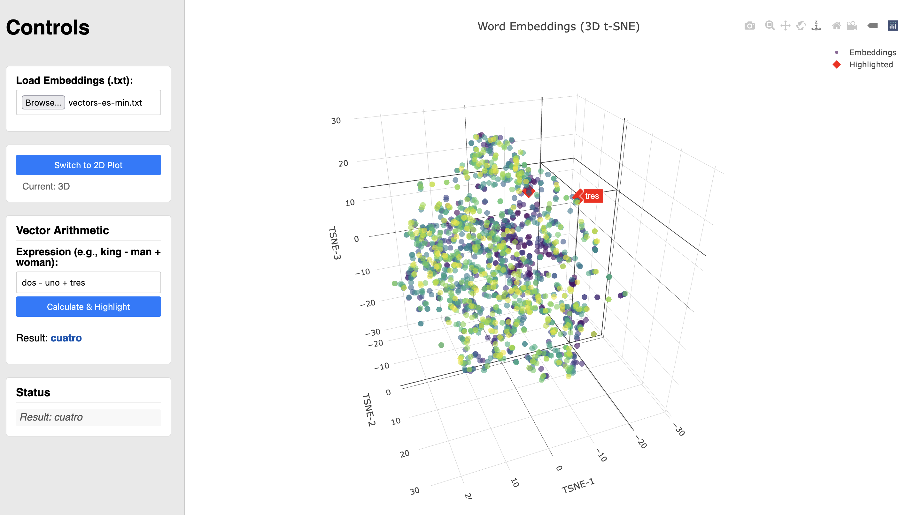

# Training and Visualizing Spanish Word Vectors with GloVe

In this project we generate Spanish word embeddings using the GloVe (Global Vectors for Word Representation) algorithm and develop an interactive tool for their exploration. The project involved utilizing the original C implementation of GloVe, training it on a Spanish Wikipedia corpus, and creating a JavaScript-based web application for visualizing the resulting vectors using t-SNE and performing vector arithmetic. Initial testing of the visualization tool was conducted using a significantly reduced subset of the trained vectors.

## Introduction

Word embeddings are a fundamental technique in Natural Language Processing (NLP), representing words as dense numerical vectors in a multi-dimensional space. These vectors capture semantic and syntactic relationships between words, such that words with similar meanings or contexts are located close to each other in the vector space. GloVe is a popular unsupervised learning algorithm for obtaining such word representations, leveraging global corpus statistics (word-word co-occurrence) to generate meaningful vectors.

The primary goal of this project was to:
a) Train custom word vectors specifically for the Spanish language using a readily available text corpus.
b) Develop an accessible tool to visually explore the relationships captured within these vectors and experiment with vector arithmetic properties (e.g., analogies).

## Methodology

The project followed these key steps:

**GloVe Implementation Source:**
The original, efficient C implementation of the GloVe algorithm, developed by the Stanford NLP group, was obtained directly from their official GitHub repository: `https://github.com/stanfordnlp/GloVe`. This implementation is known for its performance in processing large corpora.

**Data Corpus and Preparation:**
A text corpus consisting of approximately 300MB of Spanish Wikipedia articles was used as the training data.

**GloVe Vector Training:**
The downloaded GloVe C implementation tools were used to process the Spanish Wikipedia corpus. This involved the standard GloVe pipeline:
*   Building a vocabulary count.
*   Constructing a word-word co-occurrence matrix.
*   Shuffling the co-occurrence data.
*   Running the main GloVe training executable to learn the word vectors.
This process resulted in a set of Spanish word vectors, occupying approximately 100MB of storage. The dimensionality and other hyperparameters (window size, iterations) used during training would influence the final vector characteristics.

**Development of Visualization and Arithmetic Tool:**
A web-based tool was created using JavaScript to facilitate the exploration of the trained word vectors. The key features implemented were:
*   **t-SNE Visualization:** The tool incorporates t-Distributed Stochastic Neighbor Embedding (t-SNE), a dimensionality reduction technique particularly well-suited for visualizing high-dimensional data in 2D or 3D space. This allows users to visually inspect the clustering of related words.
*   **Vector Arithmetic:** Functionality was added to perform vector arithmetic operations on the word vectors. This typically allows users to test analogies, such as `"rey" - "hombre" + "mujer"` potentially resulting in a vector close to `"reina"`.

## Results and Testing

*   **Trained Vectors:** A ~100MB file containing word vectors for Spanish vocabulary derived from the Wikipedia corpus was successfully generated.
*   **Interactive Tool:** A functional JavaScript tool capable of loading word vectors, rendering a t-SNE visualization, and performing basic vector arithmetic was developed.
*   **Testing with Subset:** To test the functionality and performance of the JavaScript tool within a browser environment (which can have memory and processing limitations), a minimal subset of the trained vectors was created (~900kB). This smaller set allowed for rapid loading and testing of the t-SNE rendering logic and the vector arithmetic calculations, confirming the tool's core mechanics worked as intended.

## Future Work

Potential next steps could include:
*   Training on a significantly larger Spanish corpus for improved vector quality.
*   Experimenting with different GloVe hyperparameters (vector size, window size, iterations).
*   Optimizing the JavaScript tool to handle larger vector sets, potentially using more efficient data structures.
*   Adding more features to the tool, such as nearest neighbor search or comparison between different vector sets.
*   Evaluating the quality of the trained vectors on standard Spanish NLP benchmark tasks.
