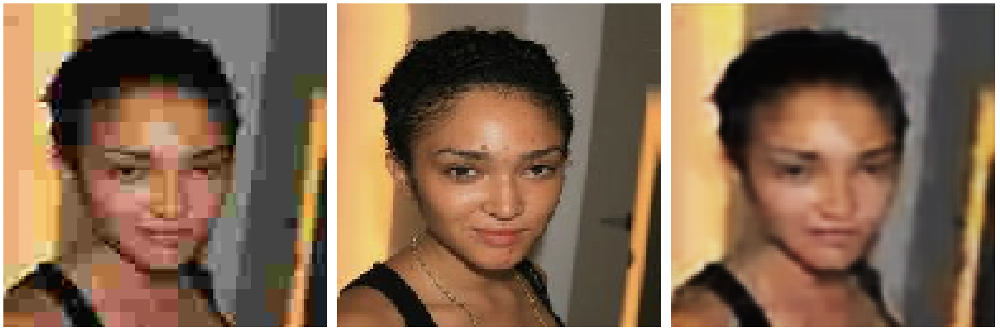

# Implementation of an Autoencoder for Super Resolution

A basic convolutional autoencoder model using TensorFlow and Keras to perform image super-resolution is implemented. Super-resolution is the task of generating a high-resolution (HR) image from a given low-resolution (LR) input image. This script sets up a data pipeline, defines a simple autoencoder architecture, trains the model on pairs of LR and HR images, and visualizes a sample prediction.

The script trains a neural network to learn a mapping from low-resolution images to corresponding high-resolution images. It achieves this by:

1.  Loading pairs of LR/HR image paths from a CSV.
2.  Using Keras generators to efficiently load, resize, and normalize image batches.
3.  Employing a custom generator to feed `(input, target)` pairs to the model.
4.  Defining a convolutional autoencoder where the encoder compresses the LR input and the decoder attempts to reconstruct the HR version.
5.  Training the model to minimize the pixel-wise Mean Squared Error between its output and the true HR images.
6.  Demonstrating the model's capability by predicting on a validation image and showing the input, output, and ground truth.

## Script basic configuration

```python
BASE_DATA_DIR = "img"
CSV_PATH = os.path.join(BASE_DATA_DIR, "data-min.csv")
LOW_RES_DIR = os.path.join(BASE_DATA_DIR, "low_res")
HIGH_RES_DIR = os.path.join(BASE_DATA_DIR, "high_res")
TARGET_SIZE = (128, 128)
INPUT_SHAPE = (*TARGET_SIZE, 3)
BATCH_SIZE = 4
EPOCHS = 5
```

-   Defines constants for file paths, image dimensions, and training parameters.
-   `BASE_DATA_DIR`: Root directory containing the image data and CSV file.
-   `CSV_PATH`: Path to the CSV file listing the image filenames.
-   `LOW_RES_DIR`, `HIGH_RES_DIR`: Directories containing the low-resolution and high-resolution images, respectively.
-   `TARGET_SIZE`: The target dimensions (height, width) to which all images will be resized. Here, both LR and HR images are resized to 128x128. This means the model learns to enhance details *within* this fixed size, rather than increasing the pixel dimensions.
-   `INPUT_SHAPE`: The shape of the input tensor for the model: (128, 128, 3) for height, width, and RGB channels.
-   `BATCH_SIZE`: Number of image pairs processed in each training step.
-   `EPOCHS`: Number of times the entire training dataset is passed through the model.


## Autoencoder Model

```python
input_img = Input(shape=INPUT_SHAPE)
# Encoder
x = Conv2D(32, (3, 3), activation="relu", padding="same")(input_img)
x = MaxPooling2D((2, 2), padding="same")(x) # 64x64
x = Conv2D(64, (3, 3), activation="relu", padding="same")(x)
encoded = MaxPooling2D((2, 2), padding="same")(x) # 32x32

# Decoder
x = Conv2D(64, (3, 3), activation="relu", padding="same")(encoded)
x = UpSampling2D((2, 2))(x) # 64x64
x = Conv2D(32, (3, 3), activation="relu", padding="same")(x)
x = UpSampling2D((2, 2))(x) # 128x128
decoded = Conv2D(3, (3, 3), activation="sigmoid", padding="same")(x)

autoencoder = Model(input_img, decoded)
autoencoder.compile(optimizer="adam", loss="mean_squared_error")
autoencoder.summary()
```

-   **Input Layer**: `Input(shape=INPUT_SHAPE)` defines the entry point for images of size 128x128x3.
-   **Encoder**:
    -   Consists of `Conv2D` layers for feature extraction and `MaxPooling2D` layers for downsampling.
    -   `Conv2D(filters, kernel_size, activation, padding)`: Applies convolution. `padding='same'` ensures the output feature map has the same height/width as the input (before pooling). `relu` is a common activation function.
    -   `MaxPooling2D((2, 2), padding='same')`: Reduces the spatial dimensions (height and width) by half.
    -   The encoder compresses the input image into a lower-dimensional latent representation (`encoded`) of size 32x32x64.
-   **Decoder**:
    -   Aims to reconstruct the high-resolution image from the `encoded` representation.
    -   Mirrors the encoder structure but uses `UpSampling2D` instead of `MaxPooling2D`.
    -   `UpSampling2D((2, 2))`: Doubles the spatial dimensions by repeating rows and columns.
    -   `Conv2D` layers are used again to learn how to refine the upsampled features.
    -   The final `Conv2D` layer has `filters=3` (for RGB output channels) and `activation='sigmoid'`. Sigmoid activation squashes the output values between 0 and 1, matching the range of the normalized input/target images.
-   **Model Creation**: `Model(input_img, decoded)` defines the complete autoencoder model, mapping the input layer to the final decoded output layer.
-   **Compilation**: `autoencoder.compile(...)` configures the model for training.
    -   `optimizer='adam'`: An efficient gradient descent optimization algorithm.
    -   `loss='mean_squared_error'` (MSE): A suitable loss function for image reconstruction tasks. It measures the average squared difference between the predicted pixel values and the ground truth pixel values (from the high-res images).
-   `autoencoder.summary()`: Prints a summary of the model's layers and parameters.

## Results

Example result after training for 50 epochs:



- Leftmost: input low resolution image.
- Middle: original image
- Rightmost: prediction.

## Limitations and Potential Improvements

-   **Simple Architecture**: The autoencoder is quite basic. More advanced architectures like U-Nets (with skip connections), Residual Networks (ResNets), or Generative Adversarial Networks (GANs) may produce sharper and more detailed results for super-resolution. Skip connections, in particular, help preserve high-frequency details lost during encoding.
-   **Fixed Size**: Both LR and HR images are resized to the *same* `TARGET_SIZE`. True super-resolution often involves upscaling the LR image dimensions (e.g., 64x64 input -> 128x128 output). This script focuses on enhancing detail within a fixed 128x128 frame.
-   **MSE Loss**: While common, MSE loss can lead to overly smooth or blurry results as it averages pixel differences. Perceptual losses or adversarial losses (in GANs) often yield visually more appealing results.
-   **No Data Augmentation**: The `ImageDataGenerator` is only used for rescaling and splitting; adding augmentation (rotations, flips, etc.) could improve robustness.
